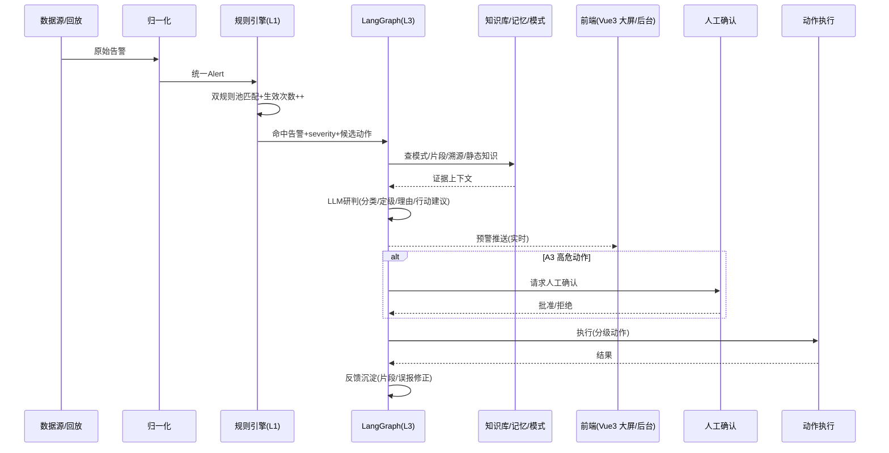
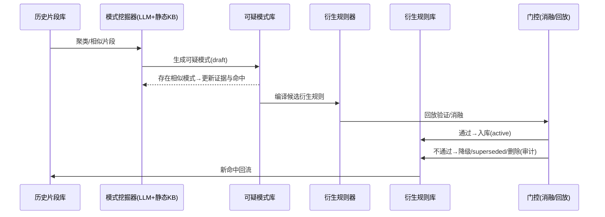

# 系统架构

> 配套文档：《开发计划.md》《开发指南.md》及 `docs/data/` 下两份数据集说明
> 技术基线：conda 环境 `scssa`；工作流/Agent 编排用 **LangGraph**，LLM API 通讯用 **openai** 客户端库；后端 **FastAPI**；演示前端 **Vue3 + Element Plus + ECharts**（监控大屏 + 后台管理，Streamlit 仅作开发期内部调试工具）；存储**轻量起步**（SQLite 结构化 + Chroma 向量 + **Kùzu 嵌入式图库**，静态网安知识图谱首阶段收录 ATT&CK）；SIEM **Wazuh**（配合 VMware 实验室）

---

## 1. 设计目标与总体原则

构建一个**自进化、多维度、面向服务器集群的安全智能体**，以大模型为决策中枢，结合**本地静态网络安全知识库**，自动总结可疑模式并沉淀为"**历史片段—可疑模式—规则**"多层记忆与**双类规则**体系，实现：自动化感知 → 智能研判 → 实时预警 → 闭环处置 → 经验迭代，并对人工提供可视化监测与规则管理前端。

核心规则理念：
- **人工规则**：只能由人工创建/修改/删除（可用自然语言描述辅助生成）；系统展示其**生效次数**。
- **衍生规则**：由系统（LLM + 模式挖掘）**自动动态增删改**，可被人工修改/停用；每个衍生规则可溯源到"可疑模式 → 历史片段"证据链。
- **触发即行动**：规则触发时不仅告警，LLM/系统按规则配置的**风险分级策略**可"一定程度上自主行动"，高风险动作默认人工确认（Human-in-the-Loop）。

设计原则：

| 原则 | 说明 |
|---|---|
| 纵向优先 | 先打通一条"告警 → 规则命中 → 研判/自主行动 → 历史片段"最小闭环，再横向扩展 |
| 规则保底、LLM 增强 | 规则引擎负责确定逻辑、高召回、可解释；LLM 负责语义研判、模式归纳与自然语言规则生成 |
| **规则分治** | 人工规则=人工权威；衍生规则=系统提议+人工可改；任何自动增删改都有审计与开关 |
| 研判可归因 | 每个结论带回溯证据（命中规则、命中模式、片段、溯源路径、记忆引用），便于错误归因 |
| 进化有门控 | 新可疑模式/衍生规则/记忆必须可回滚、可消融验证，高风险默认人工确认 |
| 一切皆事件 | 告警、命中、动作、反馈都以结构化事件存储与流转，便于回放与评测 |

---

## 2. 总体架构

```mermaid
flowchart TB
    subgraph EXT["外部环境（实验室/接入点）"]
        WZ["Wazuh Manager"]
        TGT["Target-A/B/C 审计/Sysmon/SCA 等日志"]
        API["外部 LLM API（OpenAI 兼容端点）"]
    end

    subgraph IN["① 数据接入与归一化层"]
        INGRESS["统一网络通讯接口(Ingress)<br/>HTTP Webhook / Syslog / WebSocket"]
        REPLAY["数据回放器(本地两数据集·离线)"]
        NORM["告警归一化器 → 统一 Alert"]
        ENT["溯源实体抽取(行为链/图)"]
    end

    subgraph RULEDB["② 规则层（双规则池）"]
        MR["人工规则库"]
        DR["衍生规则库"]
        ENG["规则引擎(命中/分级/去重/生效计数)"]
    end

    subgraph CORE["③ 决策中枢（LangGraph 工作流 + LLM）"]
        GRAPH["LangGraph 状态图<br/>感知→研判→决策→行动→反馈"]
        LLM["LLM 服务(openai 客户端)"]
        KB[("本地静态网络安全知识库")]
        NLASSIST["自然语言规则助手"]
    end

    subgraph MEM["④ 多层记忆与知识"]
        FRAG[("历史片段")]
        PAT[("可疑模式")]
        KG[("知识图谱(Kùzu)<br/>ATT&CK本体+动态溯源")]
        VS[("向量索引(片段/模式/知识)")]
    end

    subgraph UI["⑤ 前端与对外服务（Vue3 + FastAPI）"]
        SCREEN["监控大屏<br/>实时告警流/主机状态/趋势/规则TOP"]
        HIST["告警历史与详情"]
        RULUI["规则管理<br/>人工/衍生+生效次数+NL创建"]
        APPROVE["动作审批(A3)"]
        APIWEB["REST + WebSocket"]
    end

    subgraph ACT["⑥ 预警与自主行动层"]
        NOTIFY["分级通知"]
        ACTIONS["动作注册表(取证/查询/告警抑制/封禁等)"]
        HITL["人工确认(高风险)"]
    end

    subgraph EVO["⑦ 自进化与观测层"]
        MINE["模式挖掘(历史片段→可疑模式)"]
        DERV["衍生规则生成/更新(自动CRUD)"]
        GATE["进化门控(消融/回放/审核)"]
        EVAL["评测子系统"]
    end

    TGT --> WZ
    WZ -->|在线·后期| INGRESS
    REPLAY -->|离线·现期| INGRESS
    INGRESS --> NORM
    NORM --> ENT
    NORM --> ENG
    MR --> ENG
    DR --> ENG
    ENG --> GRAPH
    KB --> LLM
    ENT --> KG
    GRAPH --> LLM
    GRAPH --> NOTIFY
    GRAPH --> ACTIONS
    ACTIONS --> HITL
    GRAPH --> FRAG
    FRAG --> MINE
    MINE --> PAT
    PAT --> DERV
    DERV --> DR
    DERV --> GATE
    LLM --> NLASSIST
    NLASSIST --> MR
    GATE --> MINE
    GATE --> DERV
    UI --> APIWEB
    APIWEB --> ENG
    APIWEB --> GRAPH
    APIWEB --> MR
    APIWEB --> DR
    EVAL --> REPLAY
```



### 2.1 三层联动职责（在规则与模式之上的决策链）
| 层 | 载体 | 职责 | 输出 |
|---|---|---|---|
| L1 规则命中 | 规则引擎（人工规则 + 衍生规则双池） | 匹配、分级、去重、关联；**累计规则生效次数**；决定是否进入 LLM | 命中记录 + severity + 候选动作 |
| L2 模式认知 | 可疑模式匹配（片段向量召回 + 图模式命中） | 判断"是否命中历史可疑模式/复合攻击阶段"，为研判与衍生规则提供证据 | 相似模式与片段上下文 |
| L3 决策中枢 | LangGraph 工作流 + LLM + 静态知识库 | 综合 L1/L2、知识库与证据，做 TP/FP、定级、处置决策；**触发自主行动（分级/需确认）**；沉淀经验 | 研判结论 + 动作执行 + 反馈 |

### 2.2 两阶段运行策略（离线训练 → 在线靶场）
| 阶段 | 数据形态 | 网络入口 | 主要目标 |
|---|---|---|---|
| **A · 离线训练（现期）** | 本地两数据集：`linux-APT`（Linux 审计流模拟）+ `llm-soc`（178 条带标签基准） | 数据回放器经统一 Ingress 发送 | 离线跑通全链路，**基于数据集初步构建"衍生规则分层记忆系统"**（历史片段→可疑模式→衍生规则），沉淀初始人工/衍生规则与记忆基线，并做离线评测与消融 |
| **B · 在线测试（后期）** | VMware 靶场（Wazuh Manager/Target-A/B/C）真实告警 | Wazuh 转发到**同一 Ingress** | 三级联动在线运行、A0–A3 自主行动与 HITL 审批、自进化闭环稳定性验证 |

两阶段共用同一 Ingress、统一 `Alert` 模型与记忆/规则库，仅在数据源配置上切换（回放器 ↔ Wazuh 转发），系统业务侧无感。

---

## 3. 子系统说明

### 3.1 数据接入与归一化层
- **统一网络通讯接口（Ingress）**：所有进入系统的告警/事件都经同一个网络通讯接口接收（HTTP Webhook 为主，预留 Syslog/TCP 与 WebSocket），业务侧不关心数据来自离线回放还是真实采集。
- 数据源（两种形态）：
  - **离线/现期**：本地两数据集经回放器（时间压缩）投递到 Ingress，用于离线训练与记忆/规则构建、离线评测；
  - **在线/后期**：VMware 靶场 Wazuh 告警转发到同一 Ingress（适配器切换）。
- 归一化器：清洗两份数据集的分块表头/数组/时间格式，统一为 `Alert` 模型（见 §4.1）。
- 溯源实体抽取：从审计流（auditd/Sysmon）抽"主机-用户-进程-命令-文件-网络"行为链入图。

### 3.2 规则层（双规则池）
| 属性 | 人工规则 | 衍生规则 |
|---|---|---|
| 权限 | **仅人工可增删改**（NL 助手辅助编写） | **系统自动动态增删改**；可人工修改/停用/加备注 |
| 来源 | 人工/NL 助手生成 | 由"可疑模式"自动编译生成（LLM 依据静态知识库与历史片段） |
| 生命周期 | active/draft/paused/expired | draft→active→superseded/deleted（自动），人工可 pause/freeze |
| 反馈 | 命中与误报回传，辅助人工决策 | 命中/误报驱动系统自动更新（降噪、合并、停用） |
| 审计 | 记录操作人 | 每次自动增删改写入审计日志，可一键暂停"自动演化" |

- 规则条件采用**结构化 DSL（JSON 谓词）**，作用于统一 `Alert` 字段，例如 `{"field":"rule.id","op":"in","value":[5501,5402]}、{"field":"agent.ip","op":"eq","value":"…"}`；保留 `description`（含 LLM 归纳的自然语言解释）。
- 每条规则含 `severity` 与 `action_policy`（触发后允许的自主动作级别）。
- **生效次数（fired_times）**：每条规则在每次告警命中时累加（含去重/抑制后仍计触发），并提供按日聚合曲线供前端展示。

### 3.3 决策中枢（LangGraph 工作流 + LLM）
- 用 **LangGraph** 显式建模主流程为状态图：`ingest → rule_match → (需语义?) triage → decide_action → notify/execute → feedback → evolve`；节点间条件边分支，状态持久化（checkpoint），支持中断恢复与人工干预。
- LLM 通过 **openai 客户端**统一封装（`LLMClient`），结构化输出用 JSON Schema 强约束；OpenAI 兼容端点配置便于切换 DeepSeek/Qwen 等。
- **大模型四大职责**：
  1. 告警研判/决策与解释（TP/FP + priority + justification + suggested_actions）；
  2. 结合本地静态安全知识库（专业知识图谱，首阶段 ATT&CK，后续扩展 CVE/CAPEC/CWE/处置手册等），从"历史片段"归纳**可疑模式**；
  3. 将可疑模式自动编译/更新为**衍生规则**（自动 CRUD，可人工修改）；
  4. **自然语言规则助手**：把人工用自然语言描述的需求转成"人工规则"候选（含校验/预览/样例测试），经人工确认后入库。

### 3.4 多层记忆："历史片段—可疑模式—规则"
| 层 | 载体 | 内容与写入方 |
|---|---|---|
| 历史片段（Episodic） | SQLite 事件表 + Chroma 向量 | 每次告警/行动/反馈的原始记录与摘要；在线写入，低风险 |
| 可疑模式（Pattern） | Kùzu/JSON + 向量 | LLM 挖掘器对相似/反复出现片段归纳的行为模式（含支持的片段、命中数、置信、状态），门控后写入 |
| 规则（Rule，人工/衍生） | SQLite | 由可疑模式自动衍生或人工创建；命中次数实时累计 |

> 存储决策（ADR）：**轻量起步**——结构化用 SQLite，语义检索用 Chroma，图用 **Kùzu 嵌入式图库**（无服务、Python 内嵌、Cypher 类查询）；静态专业知识图谱与动态溯源共用 Kùzu，networkx 仅作导出/原型；接口层屏蔽存储实现，便于切换 Neo4j 等。

### 3.5 前端（Vue3 演示端）与对外服务（FastAPI）
页面（视觉目标：**监控大屏 + 后台管理**）：
1. **监控大屏（首页，深色科技风）**：实时告警流跑马灯、受监控主机/数据源在线状态、今日告警趋势、命中规则 TOP（含**生效次数**）、告警级别分布；自动刷新/轮播，ECharts/DataV 可视化。演示核心印象分来源。
2. **告警历史与详情**：检索/筛选/分页列表；详情抽屉展示原始告警、命中规则（含生效次数）、LLM 研判与理由、动作记录、关联历史片段/可疑模式。
3. **规则管理**：Tab1 人工规则（CRUD/启停 + **生效次数列** + 自然语言创建向导）；Tab2 衍生规则（自动更新列表、可修改/停用/冻结、来源模式与证据、系统自动变更审计）；附"自动演化"总开关。
4. **审批与设置**：A3 动作审批队列（HITL）、行动记录、可疑模式/片段浏览、LLM 端点与门控设置。

> 前端策略：Element Plus 承担后台交互（表格/表单/抽屉/弹窗），ECharts 承担大屏图表；数据统一走 FastAPI（REST + WebSocket）。**先用 Mock 数据把大屏视觉与交互搭起来**，再对接真实告警流；Streamlit 仅作为开发期内部调试工具，不承担演示。

### 3.6 预警与自主行动层（分级）
| 动作级别 | 说明 | 默认确认 |
|---|---|---|
| A0 仅通知 | 记录+通知（默认） | 无 |
| A1 只读自主 | 取证快照、查询溯源、生成研判报告 | 无 |
| A2 受限自主 | 告警聚合/抑制、隔离可疑进程（沙箱侧）、下发展示指令 | 需规则显式允许 |
| A3 处置动作 | 封禁 IP、杀进程、隔离主机、下发阻断 | **必须人工确认**（HITL） |

每条规则的 `action_policy` 声明允许的最大级别与动作白名单；执行全程写审计（谁/何时/什么动作/结果）。

### 3.7 自进化与观测
- 经验闭环：告警→行动→反馈→**历史片段**→模式挖掘→**可疑模式**→衍生规则自动增删改→回归验证。
- 门控：衍生规则/模式候选需通过样本回放 + 消融对比；人工规则变更即时生效但保留审计。
- 评测：离线 178 条基准 + linux-APT 回放回归；持续观测指标（见开发指南 §6）。

---

## 4. 核心数据模型

### 4.1 统一告警 `Alert`
```jsonc
{
  "id": "…", "timestamp": "epoch_utc", "source": "wazuh|replay|eval",
  "agent": {"name": "…", "ip": "…", "os": "linux|windows"},
  "decoder": "sca|auditd|pam|syscheck|sysmon|suricata|…",
  "family": "…", "raw": "原始 full_log/文本",
  "rule": {"id": 19007, "level": 7, "groups": [], "description": "…",
           "mitre": {"tactics": [], "techniques": []}},
  "evidence": [], "verdict": null, "label": null
}
```

### 4.2 规则 `Rule`
```jsonc
{
  "rule_id": "…", "rule_type": "manual|derived",
  "name": "…", "description": "…",            // 衍生规则含 LLM 归纳说明
  "enabled": true, "state": "active|draft|paused|superseded",
  "expression": [{"field": "rule.id", "op": "in", "value": [5501]}],
  "severity": "high", "action_policy": {"max_tier": "A2", "allow": ["snapshot"]},
  "source_pattern_id": null,                   // 衍生规则 => 来源可疑模式
  "fired_times": 0, "last_triggered_at": null,
  "owner": "system|人工", "created_at": "…", "updated_at": "…", "revision": 1,
  "audit": []
}
```

### 4.3 可疑模式 `Pattern` 与历史片段 `Fragment`
```jsonc
Pattern: { "pattern_id": "…", "title": "…", "description": "…",
  "supporting_fragment_ids": [], "hits": 0, "confidence": 0.0,
  "state": "draft|active|superseded", "derived_rule_id": null,
  "summary_meta": {"mitre": [], "created_by_llm_session": "…"} }
Fragment: { "fragment_id": "…", "alert_ids": [], "kind": "alert|action|feedback",
  "summary": "…", "embedding_id": null, "ts": "…" }
```

### 4.4 动作与审计
```jsonc
ActionRecord: { "action_id": "…", "alert_id": "…", "rule_id": "…",
  "tier": "A0..A3", "name": "封禁IP", "status": "pending|done|denied|failed",
  "approved_by": null, "result": "…", "ts": "…" }
```

### 4.5 知识图谱（Kùzu）实体关系（溯源 + 静态网安知识）
- 载体：Kùzu 嵌入式图库；首阶段静态知识收录 **MITRE ATT&CK 企业版（STIX 2.1）**，后续按需扩展 CVE/CAPEC/CWE/KEV。
- 静态知识节点：`Tactic, Technique(attack-pattern), Software(Malware/Tool), Group, Campaign, CourseOfAction`；关系取自 STIX `relationship` 对象（`subtechnique_of / uses / mitigates / targets` 等），以 ATT&CK ID（如 T1078）为主键。
- 动态溯源节点：`Host, User, Process, File, Command, NetworkFlow, Alert, Pattern`；关系：运行/执行/派生/访问/涉及；`Alert-映射→Technique`、`Alert-关联→Pattern` 把动态数据桥接到静态本体。
- 检索：LLM/规则侧用"向量召回候选（Chroma）+ Kùzu 多跳查询（如 告警→Technique→Tactic/同族告警）"组合注入上下文。

---

## 5. 运行时主流程

### 5.1 处置流（LangGraph，离线/在线共用）


### 5.2 自进化流（模式挖掘 → 衍生规则自动 CRUD）

> 系统对衍生规则执行**自动增删改**：合并重复、按误报降级、按新证据升级/停用；人工可随时修改、暂停单条或关闭全局"自动演化"。

---

## 6. 关键技术决策（ADR）

| # | 决策 | 理由 |
|---|---|---|
| ADR-1 | 工作流/Agent 编排用 **LangGraph** | 显式状态图 + checkpoint + 条件边，天然支持断点恢复与 **Human-in-the-Loop** 确认节点，比 LangChain Agent 更适合"研判→行动→确认→反馈"这类有状态流程 |
| ADR-2 | LLM 结构化调用用 **openai 客户端** | JSON Schema 强约束 + 统一的 OpenAI 兼容端点，切换模型零改动 |
| ADR-3 | 告警统一 `Alert` 模型 | 屏蔽 linux-APT（Linux/Wazuh）与 llm-soc（Windows/Sysmon）schema 差异 |
| ADR-4 | **双规则池**：人工规则仅人工可改；衍生规则系统自动 CRUD + 人工可改 | 兼顾自动化进化的价值与"规则权威归属人"的可靠性 |
| ADR-5 | 规则均带 **生效次数** 统计 | 支撑"规则有效性"观测与自动降噪决策 |
| ADR-6 | 记忆按"历史片段→可疑模式→规则"分层 | 每个衍生规则可追溯证据链，归因清晰 |
| ADR-7 | 自主行动按 A0–A3 分级，A3 强制 HITL | 在"自动化价值"与"误操作风险"之间取平衡 |
| ADR-8 | 演示前端 **Vue3 + Element Plus + ECharts**（大屏+后台），Streamlit 仅作内部调试工具；存储 SQLite+Chroma+Kùzu | 大屏+后台管理能最大化评委演示观感；前后端经 FastAPI(REST+WebSocket) 解耦；Streamlit 保底用于快速调试 |
| ADR-9 | 本地网安知识库做成**专业知识图谱**，图库用 **Kùzu**（嵌入式）；首阶段仅收录 ATT&CK 企业版 | 无 Docker/服务依赖、契合轻量起步；Cypher 类多跳查询满足"告警→技术→战术"知识检索；先打通 ATT&CK 链路再扩展 CVE/CAPEC |

---

## 7. 部署视图与依赖

- 进程划分（单机开发期）：
  1. `backend`：FastAPI（REST + WebSocket），承载 LangGraph 执行与规则/记忆访问；
  2. `worker`：流式回放/采集与周期模式挖掘（可并入 backend 或独立进程）；
  3. `web`：Vue3 + Vite 演示前端（开发期 `npm run dev`，演示时构建产物由 FastAPI 静态托管同源访问）；Streamlit（可选）仅内部调试。
- 存储：SQLite（规则/片段/动作/审计）+ Chroma（向量）+ **Kùzu**（图：ATT&CK 静态本体 + 动态溯源；networkx 仅导出/原型）。
- Python 依赖：`langgraph`、`openai`、`fastapi/uvicorn`、`pydantic-settings`、`pandas`、`chromadb`、`kuzu`、`sqlalchemy`（或 sqlmodel）、`pytest`、`websockets`；前端依赖：Node≥18、`vue3 + vite + element-plus + echarts + axios + vue-router + pinia`。
- 对外接口：统一事件入口 Ingress（Webhook，预留 Syslog/WS）、规则与查询 REST、实时推送 WebSocket、评测 CLI。
- 运行模式切换：离线=回放器投递两数据集（现期默认）；在线=Wazuh 转发同址（后期），仅改 Ingress 数据源配置。
