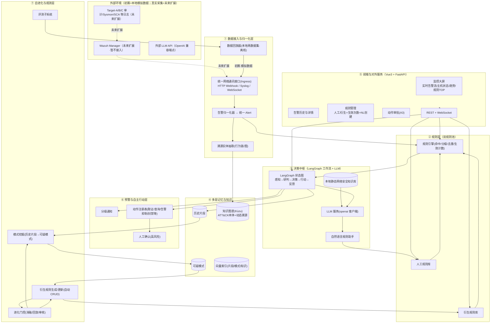
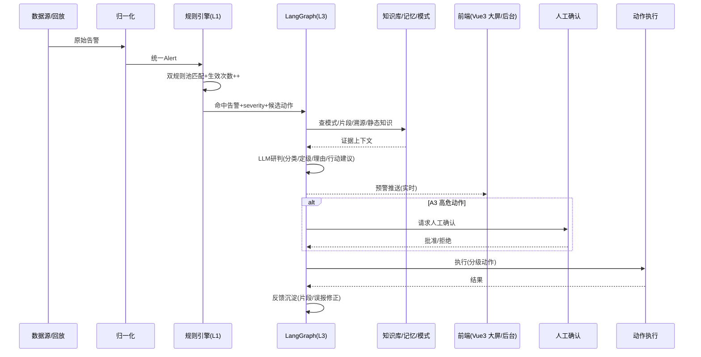
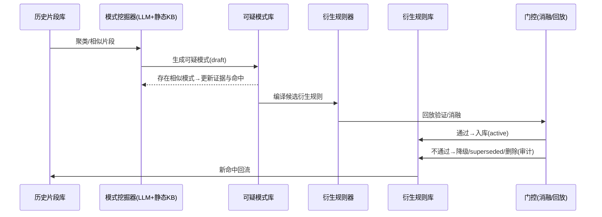

# 设计文档（交接）

## 1. 文档信息
| 项 | 内容 |
|---|---|
| 文档版本 | v1.0 |
| 编制日期 | 2026-09-08 |
| 所属项目 | 2026 年度中国青年科技创新"揭榜挂帅"擂台赛 学生赛道 XH-202614「AI+安全大模型平台的智能体研究」 |
| 参赛作品 | 自进化多维度服务器安全智能体 |
| 适用范围 | 初赛阶段（本地两数据集模拟数据回放）的系统设计交接；覆盖总体架构、认知分层、子系统、数据模型、主流程、ADR、部署与缺口 |
| 配套文档 | [系统架构](../dev-plan/系统架构.md)、[开发计划](../dev-plan/开发计划.md)、[开发指南](../dev-plan/开发指南.md)、[llm-soc 数据集说明](../data/llm-soc-alert-triage-数据集说明.md)、[linux-APT 数据集说明](../data/linux-APT-Dataset-2024-数据集说明.md)、[实验记录](../experiments/实验记录.md) |

> 本文以《系统架构.md》为主源，辅以《开发计划.md》《开发指南.md》《README.md》与两份数据集说明、实验记录；数值与命名以源文件为准，源文件未记载的内容不在此展开。

---

## 2. 项目概述与设计目标
**业务背景与痛点**：传统安全设备/规则存在"规则固化、泛化弱、误报漏报高、无自进化能力"等痛点，且面向大规模服务器集群时缺乏统一的感知—研判—处置—复盘闭环。本项目以大语言模型为核心算力与决策中枢，融合本地网安专业知识图谱（Kùzu，ATT&CK 起步）、动态攻防模式经验与全维度审计数据，构建"规则底座—模式认知—数据溯源"三级联动的安全决策体系。

**设计目标**：构建一个自进化、多维度、面向服务器集群的安全智能体，实现：自动化感知 → 智能研判 → 实时预警 → 闭环处置 → 经验迭代，并对人工提供可视化监测与规则管理前端。核心能力：

- **双类规则**：人工规则仅人工增删改（支持自然语言辅助编写）；衍生规则由系统自动动态增删改、可人工修改；每条规则统计**生效次数（fired_times）**。
- **分层记忆**："历史片段 → 可疑模式 → 规则"，衍生规则可逐层溯源到模式与片段证据。
- **分级自主行动**：A0 通知 / A1 只读 / A2 受限 / A3 处置（必须人工确认 HITL）。
- **数据入口统一**：所有告警经一个网络通讯接口（Ingress）接收；初赛阶段只用本地两数据集模拟数据完成构建与闭环验收。

---

## 3. 设计原则
| 原则 | 说明 |
|---|---|
| 纵向优先 | 先打通一条"告警 → 规则命中 → 研判/自主行动 → 历史片段"最小闭环，再横向扩展 |
| 规则保底、LLM 增强 | 规则引擎负责确定逻辑、高召回、可解释；LLM 负责语义研判、模式归纳与自然语言规则生成 |
| 双系统协同 | 潜意识（快）= 人工规则 + 记忆模式匹配；显意识（慢）= LLM 推理 + 经验累积；显意识决策回流固化为潜意识，越用越准 |
| 规则分治 | 人工规则 = 人工权威；衍生规则 = 系统提议 + 人工可改；任何自动增删改都有审计与开关 |
| 研判可归因 | 每个结论带回溯证据（命中规则、命中模式、片段、溯源路径、记忆引用），便于错误归因 |
| 进化有门控 | 新可疑模式/衍生规则/记忆必须可回滚、可消融验证，高风险默认人工确认 |
| 一切皆事件 | 告警、命中、动作、反馈都以结构化事件存储与流转，便于回放与评测 |

工程侧补充原则（《开发指南》§1）：错误归因优先、消融验证、成本可控（只有需语义判断的告警才走 LLM，先规则后模型）。

---

## 4. 总体架构

### 4.1 分层架构图


### 4.2 分层职责表
| 子系统 | 职责 | 关键接口/产物 |
|---|---|---|
| ① 数据接入与归一化层 | 统一接收告警/事件，清洗归一化为统一 `Alert`，抽取溯源实体 | Ingress（`POST /api/v1/ingest`）、`Alert` 事件流、行为链入图 |
| ② 规则层（双规则池） | 人工/衍生规则匹配、分级、去重、关联，累计 `fired_times`，决定是否进入 LLM | 命中记录 + severity + 候选动作 |
| ③ 决策中枢 | LangGraph 状态图编排"感知→研判→决策→行动→反馈"，LLM 语义研判与模式归纳 | 研判结论 + 动作执行 + 反馈 |
| ④ 多层记忆与知识 | 片段/模式/知识图谱/向量索引的读写与检索，提供证据链 | 相似模式与片段上下文、图谱多跳结果 |
| ⑤ 前端与对外服务 | Vue3 大屏与后台管理，FastAPI 提供 REST + WebSocket | 页面与 API |
| ⑥ 预警与自主行动层 | 分级通知、动作注册表、A0–A3 分级执行、A3 人工确认 | 通知 + 动作记录（含审计） |
| ⑦ 自进化与观测层 | 模式挖掘、衍生规则自动 CRUD、进化门控、离线评测 | 新模式/衍生规则候选、评测报告 |

### 4.3 运行策略
| 阶段 | 数据形态 | 网络入口 | 主要目标 |
|---|---|---|---|
| 初赛（当前） | 本地两数据集（模拟数据）：`linux-APT`（Linux 审计流模拟）+ `llm-soc`（178 条带标签基准） | 回放器经统一 Ingress 发送 | 模拟数据下跑通全链路，构建"衍生规则分层记忆系统"与记忆基线、三级联动、A0–A3 自主行动与 HITL、自进化人机协同闭环验收及离线评测/消融 |

> 真实 SIEM（Wazuh/VMware 靶场）在线接入已从待办移除——初赛阶段只以本地两数据集模拟数据验收。Ingress/统一 `Alert` 模型与记忆规则库均与数据源解耦；未来如需真实接入，仅需新增数据源适配器，业务侧无感。

---

## 5. 认知分层设计

### 5.1 三层联动职责
| 层 | 认知归属 | 载体 | 职责 | 输出 |
|---|---|---|---|---|
| L1 规则命中 | 潜意识 | 规则引擎（人工规则 + 衍生规则双池） | 匹配、分级、去重、关联；累计规则生效次数；决定是否进入 LLM | 命中记录 + severity + 候选动作 |
| L2 模式认知 | 潜意识 | 可疑模式匹配（片段向量召回 + 图模式命中） | 判断"是否命中历史可疑模式/复合攻击阶段"，为研判与衍生规则提供证据 | 相似模式与片段上下文 |
| L3 决策中枢 | 显意识 | LangGraph 工作流 + LLM + 静态知识库 | 综合 L1/L2、知识库与证据，做 TP/FP、定级、处置决策；触发自主行动；沉淀经验 | 研判结论 + 动作执行 + 反馈 |

### 5.2 潜意识（System 1）与显意识（System 2）
| 认知 | 对应层 | 载体 | 行为 |
|---|---|---|---|
| 潜意识（System 1 · 快） | L1 规则命中 + L2 模式认知 | 人工规则库 + 衍生规则库（固化产物）+ 多层记忆可疑模式匹配 | 确定性匹配、高召回、低延迟、可解释、带回溯证据；命中即定级并给出候选动作，一般不再唤醒 LLM |
| 显意识（System 2 · 慢） | L3 决策中枢 | LangGraph 工作流 + LLM + 本地静态知识库 | 语义研判（TP/FP、定级、处置建议）、跨域推理与模式归纳；由潜意识未覆盖/低置信的输入唤醒 |

- **经验累积闭环（显意识 → 潜意识固化）**：显意识每次决策与反馈沉淀为历史片段（Episodic）→ 周期挖掘器归纳为可疑模式 → 编译为衍生规则注入潜意识规则池。潜意识越用越厚，显意识越用越省。
- **人工规则定位**：潜意识底座中永不自动变化的部分（人工权威）；衍生规则是潜意识中可自进化的部分（有门控与审计、可冻结/停用）。两者均对前端暴露"生效次数/最近触发/审计"。
- **对应数据集运行路径**：`linux-APT`（规则回退）演示纯潜意识快判路径，`llm-soc`（DeepSeek 实判）演示显意识推理路径；两条路径产生的经验汇入同一多层记忆库（SQLite+Chroma）。

### 5.3 处置分流与经验升格（规格 v1）
**处置分流（规则匹配 = 双向匹配）**：告警并行匹配"人工规则池 + 多层记忆可疑模式"。

- 命中**人工规则** → 潜意识直发（`need_llm=False`），照常记命中计数与经验片段；
- 命中**可疑模式/有相似记忆**而未命中人工规则 → 走显意识：`gather_evidence`（图谱多跳 + 相似片段 + 命中模式）→ 注入 LLM triage；
- 均未命中 → 按成本策略回退（需 LLM 则无证据研判）。

模式命中只是"与历史样本相似"的证据，不替代语义判定；人工规则结论为权威，LLM 与衍生规则为建议，可覆盖且留审计。

**经验升格状态机**：`人工规则处置 → 复核/反馈(feedback fragment) → 记忆样本累积 ≥N → 新可疑模式（有界 LLM 归纳+审计） → 作为证据辅助下一轮 LLM 研判 → 验证有效 → 前端呈现待升格候选 → 用户拍板升格为人工规则 → 重新处置`。

**规则权威分级**：① 人工规则（仅人工增删改，命中直发）② 可疑模式/衍生规则（自进化中间态，自动 CRUD + 门控 + 审计 + 可冻结，只建议不裁决）③ feedback 片段/历史片段（低权威经验原料，随时写）。任意跳步可溯源：规则→模式→片段。状态机与双系统认知一一对应（潜意识＝人工规则直发，显意识＝模式命中的证据化推理）。

---

## 6. 子系统设计

### 6.1 数据接入与归一化
- **职责**：所有告警/事件经同一个网络通讯接口接收；清洗归一化为统一 `Alert`；抽取溯源实体。
- **输入输出**：入 = 回放器投递的原始告警文本/JSON（初赛）或未来 SIEM 转发；出 = 统一 `Alert` 事件流、主机侧行为链（入 Kùzu）。
- **关键实现**：Ingress（`POST /api/v1/ingest`，HTTP Webhook 为主，预留 Syslog/TCP 与 WebSocket，支持幂等去重与限速）；数据源（初赛 = 模拟数据）为 `linux-APT` CSV 与 `llm-soc` JSONL 经回放器（时间压缩）投递；归一化器清洗两份数据集的分块表头/数组/时间格式，统一为 `Alert`；溯源实体抽取从审计流（auditd/Sysmon）抽"主机-用户-进程-命令-文件-网络"行为链入图。
- **落地状态**：预处理脚本 `scripts/preprocess_datasets.py`（`linux-apt` / `llm-soc` / `all`，仅标准库）已产出 `data/processed/linux_apt_alerts.jsonl`、`data/processed/llm_soc_alerts.jsonl`（见数据集说明 §6）；回放与 Ingress 为阶段二交付。

### 6.2 规则层（双规则池）
- **职责**：对 `Alert` 做双池匹配、分级、去重、关联，累计规则生效次数，判断是否需进入 LLM。
- **输入输出**：入 = 统一 `Alert`；出 = 命中记录 + severity + 候选动作。
- **关键实现**：

| 属性 | 人工规则 | 衍生规则 |
|---|---|---|
| 权限 | 仅人工可增删改（NL 助手辅助编写） | 系统自动动态增删改；可人工修改/停用/加备注 |
| 来源 | 人工/NL 助手生成 | 由"可疑模式"自动编译生成 |
| 生命周期 | active/draft/paused/expired | draft→active→superseded/deleted（自动），人工可 pause/freeze |
| 反馈 | 命中与误报回传，辅助人工决策 | 命中/误报驱动系统自动更新（降噪、合并、停用） |
| 审计 | 记录操作人 | 每次自动增删改写入审计日志，可一键暂停"自动演化" |

规则条件采用结构化 DSL（JSON 谓词），作用于统一 `Alert` 字段，如 `{"field":"rule.id","op":"in","value":[5501,5402]}`；保留 `description`（含 LLM 归纳的自然语言解释）；每条规则含 `severity` 与 `action_policy`（触发后允许的自主动作级别）；`fired_times` 在每次告警命中时累加（含去重/抑制后仍计触发），提供按日聚合曲线供前端展示。
- **落地状态**：规则引擎 v1 = 由 llm-soc 的 Wazuh `rule.id` 自动导入的规则种子（规则池共 74 条）；衍生规则由 `RuleCompiler` 自动 CRUD 生成（见 6.7）。

### 6.3 决策中枢（LangGraph + LLM）
- **职责**：显式建模主流程为状态图，调用 LLM 做语义研判、模式归纳、衍生规则编译与自然语言规则生成。
- **输入输出**：入 = 命中告警 + 证据上下文；出 = `verdict`（TP/FP + priority + justification）+ 动作计划 + 反馈。
- **关键实现**：状态图 `ingest → rule_match → (需语义?) triage → decide_action → notify/execute → feedback → evolve`，节点间条件边分支（`add_conditional_edges`），状态持久化（checkpoint），支持中断恢复与人工干预；LLM 经 `LLMClient`（openai 客户端）统一封装，结构化输出用 JSON Schema 强约束，非法输出回退规则结论，`temperature=0.0`；研判输出口径（对齐 llm-soc）：`classification ∈ {TP,FP}`、`priority ∈ {Low,Medium,High,Critical}`、`justification`、`evidence_ids`、`suggested_actions`。
- **大模型四大职责**：① 告警研判/决策与解释；② 结合静态知识库从历史片段归纳可疑模式；③ 将可疑模式自动编译/更新为衍生规则；④ 自然语言规则助手（NL → 人工规则候选，含校验/预览/样例测试）。
- **落地状态**：`make_v2_graph`（可选 `gather_evidence` 节点，`--joint-evidence` 启用）与 `make_v3_graph`（命中源裁决三态，`--triage v3`）均已实现；`scripts/run_agent_v1.py` 为处置流运行入口。

### 6.4 多层记忆
- **职责**：以"历史片段—可疑模式—规则"三层承载经验，支撑向量检索、模式归纳与证据注入。
- **输入输出**：入 = 告警/行动/反馈事件、相似度查询；出 = 相似片段/命中模式/证据链。
- **关键实现**：

| 层 | 载体 | 内容与写入方 |
|---|---|---|
| 历史片段（Episodic） | SQLite 事件表 + Chroma 向量 | 每次告警/行动/反馈的原始记录与摘要；在线写入，低风险 |
| 可疑模式（Pattern） | Kùzu/JSON + 向量 | LLM 挖掘器对相似/反复出现片段归纳的行为模式（含支持的片段、命中数、置信、状态），门控后写入 |
| 规则（Rule） | SQLite | 由可疑模式自动衍生或人工创建；命中次数实时累计 |

- **落地状态（2026-09-08）**：片段 9,535、可疑模式 36、衍生规则 36（active 27 + draft 9）、前端"待升格候选"27。当前"多层记忆累积经验"是一条离线批处理流水线（见 6.7）。

### 6.5 前端与对外服务
- **职责**：Vue3 演示端（监控大屏 + 后台管理）与 FastAPI 对外服务（REST + WebSocket）。
- **输入输出**：入 = 后端事件流/查询；出 = 页面展示、规则 CRUD、A3 审批。
- **关键实现（页面）**：① 监控大屏（首页，深色科技风）——实时告警流、受监控主机/数据源在线状态、今日告警趋势、命中规则 TOP（含生效次数）、告警级别分布，ECharts 可视化，自动刷新/轮播；② 告警历史与详情——检索/筛选/分页，详情抽屉展示原始告警、命中规则（含生效次数）、LLM 研判与理由、动作记录、关联历史片段/可疑模式，证据面板 `GET /api/alerts/{id}/evidence`；③ 规则管理——Tab1 人工规则（CRUD/启停 + 生效次数列 + 自然语言创建向导），Tab2 衍生规则（自动更新列表、可修改/停用/冻结、来源模式与证据、系统变更审计），附"自动演化"总开关与"待升格候选"入口；④ 审批与设置——A3 动作审批队列（HITL）、行动记录、模式/片段浏览、LLM 端点与门控设置。
- **组件分工**：Element Plus 承担表格/表单/抽屉/弹窗，ECharts 承担大屏图表；数据统一走 FastAPI（axios REST + 原生 WebSocket）；先用 Mock 数据搭视觉再对接真实告警流；Streamlit 仅作开发期内部调试工具。
- **落地状态**：v1 Agent 处置结果已接进 Vue3 面板做数据集流示例演示（`src/core/api/demo.py`、`src/core/api/replay.py`、`src/core/api/server.py`）；静态资源由 FastAPI 同端口托管。

### 6.6 预警与自主行动
- **职责**：按分级策略通知与执行动作，高风险动作走人工确认。
- **输入输出**：入 = `decide_action` 生成的动作计划 + 规则 `action_policy`；出 = 通知/动作记录（含审计）。
- **关键实现（动作分级）**：

| 动作级别 | 说明 | 默认确认 |
|---|---|---|
| A0 仅通知 | 记录+通知（默认） | 无 |
| A1 只读自主 | 取证快照、查询溯源、生成研判报告 | 无 |
| A2 受限自主 | 告警聚合/抑制、隔离可疑进程（沙箱侧）、下发展示指令 | 需规则显式允许 |
| A3 处置动作 | 封禁 IP、杀进程、隔离主机、下发阻断 | 必须人工确认（HITL） |

每条规则的 `action_policy` 声明允许的最大级别与动作白名单；执行全程写审计（谁/何时/什么动作/结果）；HITL 通过 LangGraph `interrupt()`/checkpointer 在 `execute_action` 前挂起，前端"人工确认"接口恢复执行。
- **落地状态**：v1 Agent 能力边界为**仅告警 notify，无任何自主动作**（动作集合 `['notify']`）；A0–A3 分级执行与 A3 审批为阶段五交付。

### 6.7 自进化与观测
- **职责**：经验闭环（片段→模式→衍生规则）、进化门控、离线评测。
- **输入输出**：入 = 历史片段库；出 = 可疑模式（draft/active）、衍生规则（自动 CRUD）、评测报告。
- **关键实现（经验累积流水线，现状）**：

| 环节 | 载体/实现 | 产物 | 状态 |
|---|---|---|---|
| ① 经验产生 | `scripts/run_agent_v1.py`：每条告警走 LangGraph 处置流 → 处置事件 JSONL | `log/agent_v1_*.jsonl` | 已实现（离线） |
| ② 底层 · 片段沉淀 | `scripts/build_memory_baseline.py` → `MemoryStore.add_fragments`（SQLite+Chroma，幂等 `frag-{ds}-{seq}`） | fragment 表（9,535）+ 向量 | 已实现 |
| ③ 中间层 · 模式归纳 | `PatternMiner.mine(ds)`：片段簇启发式（行为链共现/高 FP 噪声）+ 有界 LLM 归纳；拒否指纹持久化 `evo.miner.reject.{ds}` 防复活 | pattern 表（36） | 已实现 |
| ④ 顶层 · 规则固化 | `RuleCompiler.run(ds)`：active 模式 → 衍生规则自动 CRUD（受 `auto_evolve` 门控、全审计）→ 回填 `pattern.derived_rule_id` | rule 表（36：active 27 + draft 9） | 已实现 |

门控：衍生规则/模式候选需通过样本回放 + 消融对比；人工规则变更即时生效但保留审计。评测：离线 178 条基准 + linux-APT 回放回归（见第 11 章）。

---

## 7. 核心数据模型

### 7.1 统一告警 `Alert`
```jsonc
{
  "id": "…", "timestamp": "epoch_utc", "source": "wazuh|replay|eval",
  "agent": {"name": "…", "ip": "…", "os": "linux|windows"},
  "decoder": "sca|auditd|pam|syscheck|sysmon|suricata|…",
  "family": "…", "raw": "原始 full_log/文本",
  "rule": {"id": 19007, "level": 7, "groups": [], "description": "…",
           "mitre": {"tactics": [], "techniques": []}},
  "evidence": [], "verdict": null, "label": null
}
```

### 7.2 规则 `Rule`
```jsonc
{
  "rule_id": "…", "rule_type": "manual|derived",
  "name": "…", "description": "…",            // 衍生规则含 LLM 归纳说明
  "enabled": true, "state": "active|draft|paused|superseded",
  "expression": [{"field": "rule.id", "op": "in", "value": [5501]}],
  "severity": "high", "action_policy": {"max_tier": "A2", "allow": ["snapshot"]},
  "source_pattern_id": null,                   // 衍生规则 => 来源可疑模式
  "fired_times": 0, "last_triggered_at": null,
  "owner": "system|人工", "created_at": "…", "updated_at": "…", "revision": 1,
  "audit": []
}
```

### 7.3 可疑模式 `Pattern` 与历史片段 `Fragment`
```jsonc
Pattern: { "pattern_id": "…", "title": "…", "description": "…",
  "supporting_fragment_ids": [], "hits": 0, "confidence": 0.0,
  "state": "draft|active|superseded", "derived_rule_id": null,
  "summary_meta": {"mitre": [], "created_by_llm_session": "…"} }

Fragment: { "fragment_id": "…", "alert_ids": [], "kind": "alert|action|feedback",
  "summary": "…", "embedding_id": null, "ts": "…" }
```

### 7.4 动作与审计
```jsonc
ActionRecord: { "action_id": "…", "alert_id": "…", "rule_id": "…",
  "tier": "A0..A3", "name": "封禁IP", "status": "pending|done|denied|failed",
  "approved_by": null, "result": "…", "ts": "…" }
```

### 7.5 知识图谱实体关系（Kùzu）
- **载体**：Kùzu 嵌入式图库；首阶段静态知识收录 MITRE ATT&CK 企业版（STIX 2.1），后续按需扩展 CVE/CAPEC/CWE/KEV。
- **静态知识节点**：`Tactic, Technique(attack-pattern), Software(Malware/Tool), Group, Campaign, CourseOfAction`；关系取自 STIX `relationship` 对象（`subtechnique_of / uses / mitigates / targets` 等），以 ATT&CK ID（如 T1078）为主键。
- **动态溯源节点**：`Host, User, Process, File, Command, NetworkFlow, Alert, Pattern`；关系：运行/执行/派生/访问/涉及；`Alert-映射→Technique`、`Alert-关联→Pattern` 把动态数据桥接到静态本体。
- **检索**：向量召回候选（Chroma）+ Kùzu 多跳查询（如 告警→Technique→Tactic/同族告警）组合注入上下文。
- **实测规模**：Tactic=15、Technique=697、ThreatActor=1057、Mitigation=44；边 HAS_TACTIC=872 / SUBTECHNIQUE_OF=475 / USES=17136 / MITIGATES=1448。

---

## 8. 运行时主流程

### 8.1 处置流时序


**处置分流 v3（命中源裁决三态）落地状态（2026-09-08）**：`run_agent_v1 --triage v3`——① `manual`：命中记忆库人工权威规则（auto=0）→ 潜意识直发（不唤醒 LLM）；② `memory`：命中"过去可疑模式"（全部支撑片段早于当前，防泄漏）或相似记忆 → **必走 LLM**（注入模式/片段/图谱证据）；③ `policy`：无记忆命中 → 按成本策略回退。事件带 `channel` 字段；可选 `--conflict-feedback` 仅当 LLM 判定与官方真值冲突才写回 feedback 片段（method=conflict、幂等、审计）。隔离冒烟 `scripts/smoke_triage_v3.py` 16/16。

### 8.2 自进化流时序


> 系统对衍生规则执行自动增删改：合并重复、按误报降级、按新证据升级/停用；人工可随时修改、暂停单条或关闭全局"自动演化"。

---

## 9. 关键设计决策（ADR）
| # | 决策 | 理由 |
|---|---|---|
| ADR-1 | 工作流/Agent 编排用 **LangGraph** | 显式状态图 + checkpoint + 条件边，天然支持断点恢复与 Human-in-the-Loop 确认节点，比 LangChain Agent 更适合"研判→行动→确认→反馈"这类有状态流程 |
| ADR-2 | LLM 结构化调用用 **openai 客户端** | JSON Schema 强约束 + 统一的 OpenAI 兼容端点，切换模型零改动 |
| ADR-3 | 告警统一 `Alert` 模型 | 屏蔽 linux-APT（Linux 审计流）与 llm-soc（Windows/Sysmon）schema 差异 |
| ADR-4 | **双规则池**：人工规则仅人工可改；衍生规则系统自动 CRUD + 人工可改 | 兼顾自动化进化的价值与"规则权威归属人"的可靠性 |
| ADR-5 | 规则均带 **生效次数** 统计 | 支撑"规则有效性"观测与自动降噪决策 |
| ADR-6 | 记忆按"历史片段→可疑模式→规则"分层 | 每个衍生规则可追溯证据链，归因清晰 |
| ADR-7 | 自主行动按 A0–A3 分级，A3 强制 HITL | 在"自动化价值"与"误操作风险"之间取平衡 |
| ADR-8 | 演示前端 **Vue3 + Element Plus + ECharts**（大屏+后台），Streamlit 仅作内部调试工具；存储 SQLite+Chroma+Kùzu | 大屏+后台管理能最大化评委演示观感；前后端经 FastAPI(REST+WebSocket) 解耦；Streamlit 保底用于快速调试 |
| ADR-9 | 本地网安知识库做成**专业知识图谱**，图库用 **Kùzu**（嵌入式）；首阶段仅收录 ATT&CK 企业版 | 无 Docker/服务依赖、契合轻量起步；Cypher 类多跳查询满足"告警→技术→战术"知识检索；先打通 ATT&CK 链路再扩展 CVE/CAPEC |

---

## 10. 部署视图与依赖

### 10.1 进程划分（单机开发期）
1. `backend`：FastAPI（REST + WebSocket），承载 LangGraph 执行与规则/记忆访问；
2. `worker`：流式回放/采集与周期模式挖掘（可并入 backend 或独立进程）；
3. `web`：Vue3 + Vite 演示前端（开发期 `npm run dev`，演示时构建产物由 FastAPI 静态托管同源访问）；Streamlit（可选）仅内部调试。

### 10.2 存储
- SQLite（WAL）：规则/片段/动作/审计；Chroma：向量（片段/模式/Technique 文本）；Kùzu 0.11.3：图（ATT&CK 静态本体 + 动态溯源）；networkx 仅导出/原型。
- **Windows 路径注意**：Kùzu（Windows）窄字符路径不支持中文等非 ASCII，而本项目路径含中文，故库文件实际落在 `%TEMP%\scssa_kb\attack_kuzu` 或环境变量 `SCSSA_KUZU_DB` 指定目录；脚本对非 ASCII `--db` 会自动回退该变量或 Temp。

### 10.3 依赖
- **Python（conda 环境 `scssa`，Python 3.10）**：`langgraph`、`openai`、`fastapi/uvicorn`、`pydantic v2`、`pydantic-settings`、`pandas`、`chromadb`、`kuzu`、`sqlalchemy`（或 sqlmodel）、`pytest`、`websockets`。
- **前端（Node ≥ 18，仓库根 `web/`）**：`vue3 + vite + typescript + element-plus + echarts + axios + vue-router + pinia`。

### 10.4 对外接口
- 统一事件入口 Ingress（Webhook，预留 Syslog/WS）；规则与查询 REST；实时推送 WebSocket；评测 CLI。
- 演示接口示例：`GET /api/health`、`GET /api/dashboard`、`GET /api/alerts`、`GET /api/rules`、`WS /ws/feed`、`POST /alerts/{id}/review`、`GET /api/alerts/{id}/evidence`、`GET /api/evolution/promote-candidates`、`POST /api/evolution/promote`。
- 运行模式（初赛）：回放器把本地两数据集投递 Ingress；真实 SIEM 在线接入不在初赛待办。

---

## 11. 设计约束与已知缺口

### 11.1 范围界定
初赛阶段**只以本地两数据集模拟数据验收**，真实 SIEM（Wazuh/VMware 靶场）在线接入已从待办移除（列为未来扩展）；未来接入仅需为同一 Ingress 新增数据源适配器，业务侧无感。

### 11.2 数据约束
- `llm-soc`：178 条（官方标签 TP=104 / FP=74；优先级 Low 136 / Medium 12 / High 25 / Critical 5，类极度不均衡；MIT 许可）；优先级 ground truth 仅为 `rule.level` 的粗粒度映射，非人工研判严重度，且 `rule.level` 已从 `alert` 中移除以防"抄答案"。
- `linux-APT-2024`：原始 198.7 MB，CSV 逻辑记录 122,563 数据行，可靠对齐仅 9,357 条（其中 98 条按"规则级 MITRE 非空"口径可疑）；多段重复表头，禁止直接整表 `pandas.read_csv`。

### 11.3 评测结果与缺口
- **v1 首轮全量（llm-soc 178，DeepSeek 实判，temperature=0）**：Acc 0.7640 / 检出精确率 0.8974 / 检出召回率 0.6731 / 检出 F1 0.7692 / 优先级一致率 53.9%（96/178）。
- **联合决策消融（流式防泄漏）**：基线 acc_all 0.758 / acc_decided 0.780 / macro-F1 0.780；+多层记忆 0.803 / 0.812 / 0.812；+知识图谱（单独）0.736 / 0.766 / 0.766；记忆+图谱联合 0.803 / 0.812 / 0.812（无额外增益）。结论：增益主要来自多层记忆证据（约 +4.5pp），图谱单独注入为净负。
- **已知缺口**（未实现/待补）：① demo/在线"每次决策即时写 Fragment"（运行期实时沉淀）未接线；② 挖掘器"处置后自发再挖"（周期/事件触发）未实现；③ 优先级/定级口径不一致（LLM 按内容定级 vs 官方按规则等级），一致率 49~54%。

---

## 12. 参考来源
- [../dev-plan/系统架构.md](../dev-plan/系统架构.md)
- [../dev-plan/开发计划.md](../dev-plan/开发计划.md)
- [../dev-plan/开发指南.md](../dev-plan/开发指南.md)
- [../../README.md](../../README.md)
- [../data/llm-soc-alert-triage-数据集说明.md](../data/llm-soc-alert-triage-数据集说明.md)
- [../data/linux-APT-Dataset-2024-数据集说明.md](../data/linux-APT-Dataset-2024-数据集说明.md)
- [../experiments/实验记录.md](../experiments/实验记录.md)
